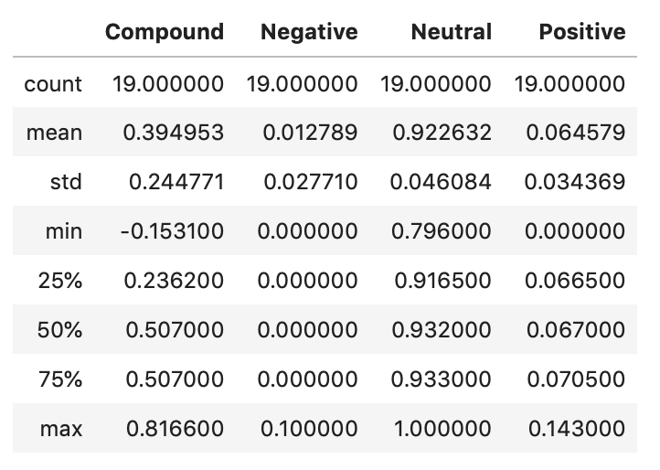
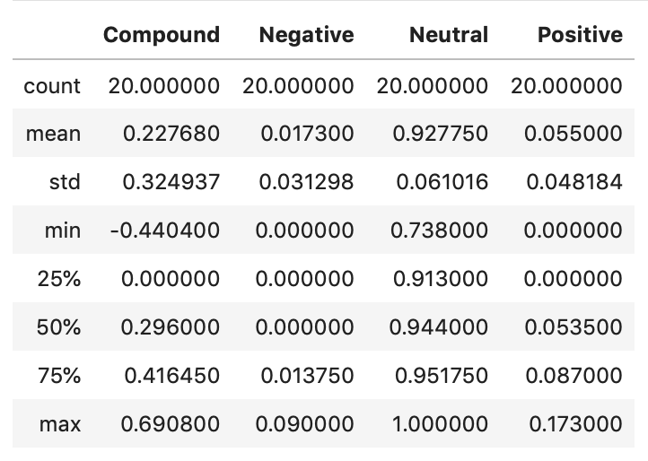
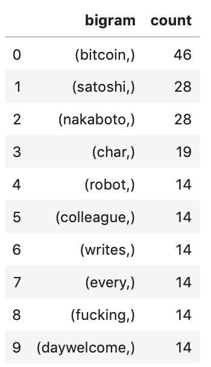
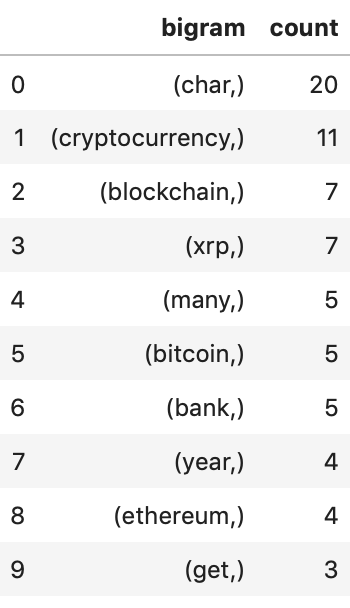
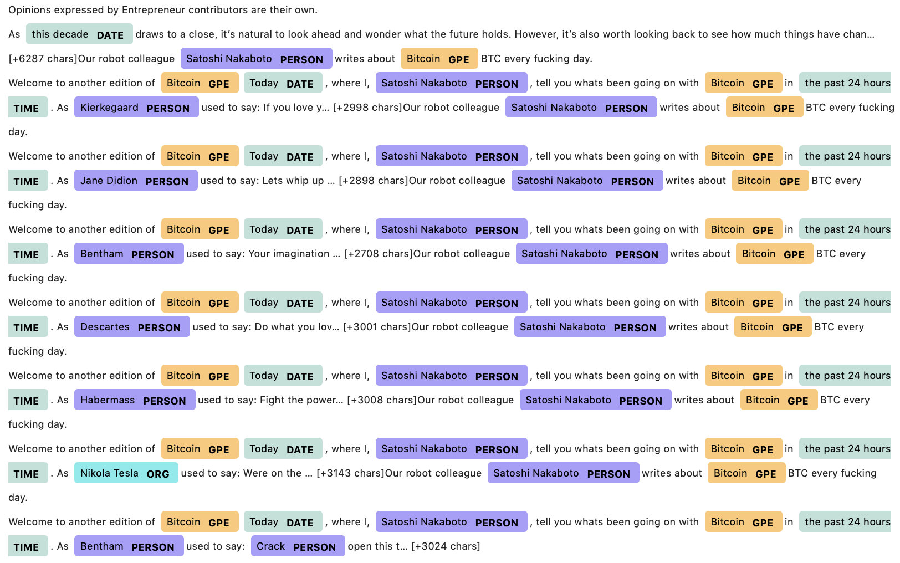
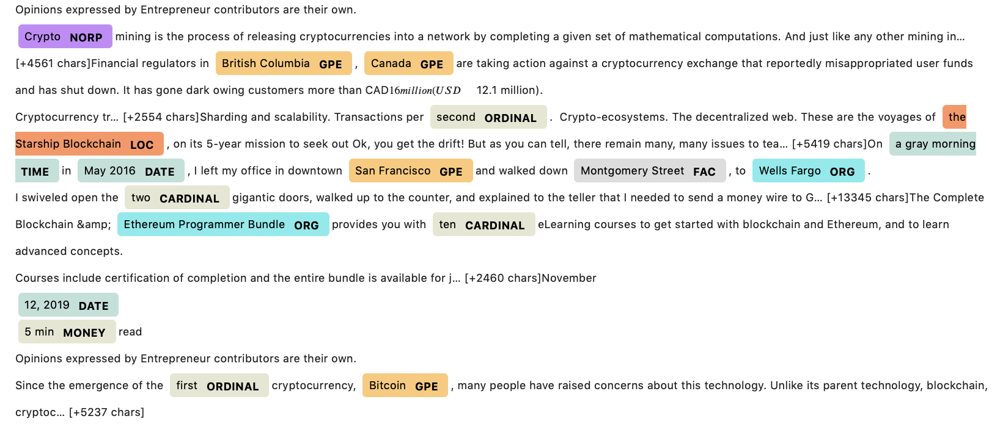

# Bitcoin vs Ethereum

In this exercise, we look at news articles about Bitcoin and Ethereum and analyze the sentiments, most commonly used words and named entities.

Looking at the articles from NewsAPI, we see that both coins returned neutral scores.

Bitcoin does show a slightly higher positive mean score, compound score and poistive score

**Bitcoin Sentiment**

**Ethereum Sentiment**

* Bitcoin had the higher mean positive score of .065 compared to Ethereum of 0.055
* Bitcoin had the higher compound positive score of .39 compared to Ethereum of 0.23
* Bitcoin had the higher positive score of 1.23 compared to Ethereum of 1.1

Looking at the most common used words, we see:

**Bitcoin Top 10 Words**

**Ethereum Top 10 Words**

Visualizing the tokens in a word cloud, we get:

**Bitcoin Word Cloud**

**Ethereum Word Cloud**

Visualizing the named entities, we get:

**Bitcoin Named Entities**

**Ethereum Named Entities**

